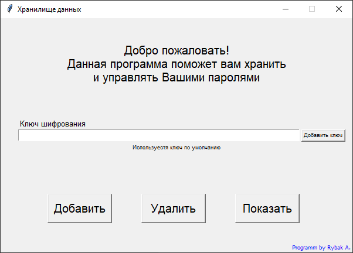
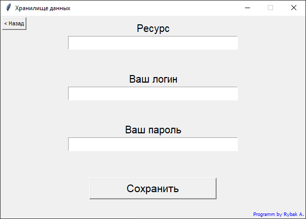
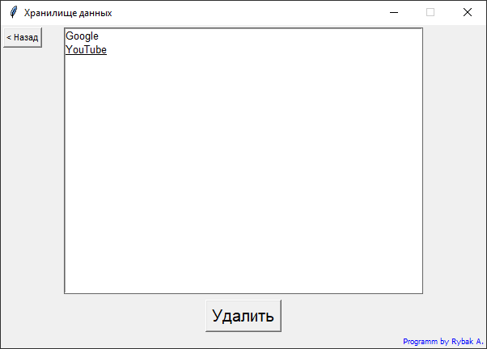
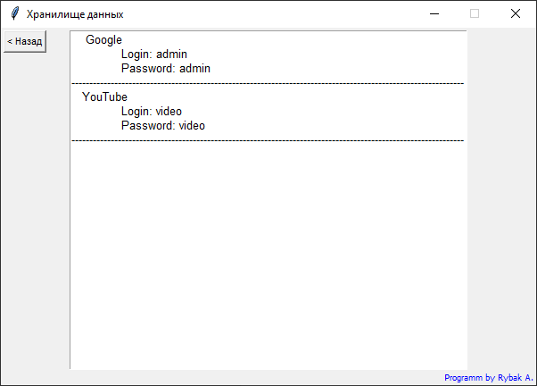
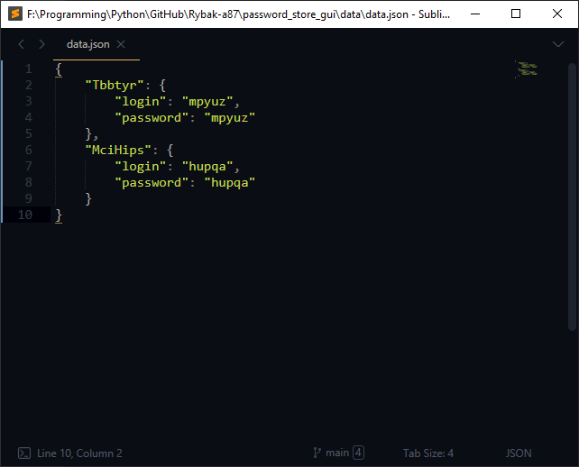

## Программа для хранения логинов и паролей с графическим интерфейсом
>#### Используется:
>- _модуль tkinter для создания графического интерфейс_
>- _ООП_
>- _работа с файлами_
>- _работа с json_
---
> Программа представляет собой оконное приложение в которое пользователь
> может добавлять ресурс с логином и паролем от него, эти данные добавляются
> в файл json с применением шифрования. Присутствует возможность применять
> свой личный ключ шифрования, по умолчанию используется “мой” ключ шифрования.
> Присутствует возможность удаления ненужных данных и возможность просмотреть
> сохраненные данные в расшифрованном виде.

## Screeshots:

